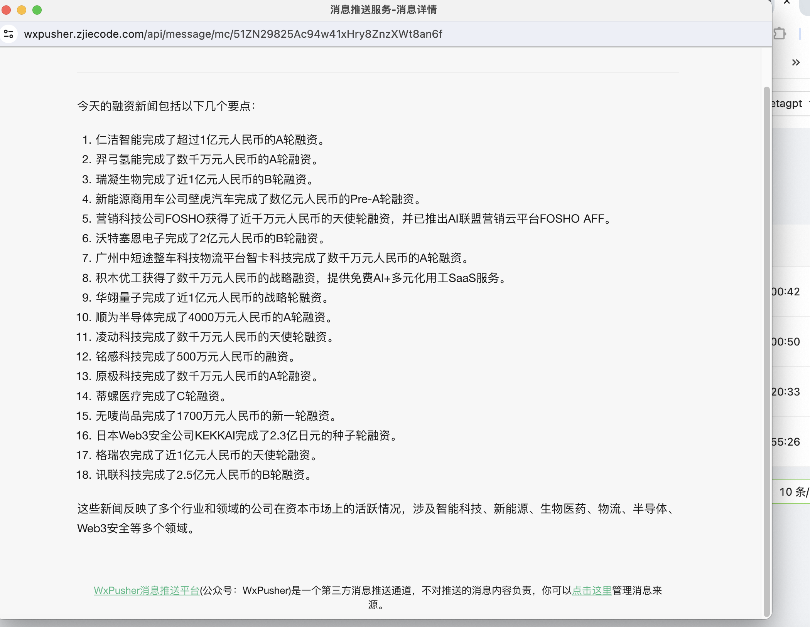

# 智能体进阶

## 案例-订阅助手代码分析用户需求

这里对ActionNode提出两个问题：

1、ActionNode 和 Action之间的关系是什么？

通过上一节课，我们知道，ActionNode 就是将一个Action进行拆分，分拆成多个Node，然后再通过fill组合成一个Action。

2、多个ActionNode的组合 和 多个Action的区别是什么？

这里课程里讲的很迷糊。很多细节没有讲。

”输入"请帮我提取https://github.com/trending的今日榜单，推荐2~3个与LLM相关的仓库，并给出推荐理由，然后在晚上七点半发送给我"，

这样的一个需求，之前是用三个Action来实现的，现在用ActionNode来代替其中的一些需求。目的是使用浏览器自动化的方式爬取网页，然后让大模型写从html中提取用户需要的数据，把获取到网页内容提取的代码和浏览器自动化的方式爬取网页的代码进行结合，就可以得到爬取指定网页信息的Action，然后再将提取后的数据，让大模型进行处理和分析，这就得到网页数据分析的Action，将这两个Action组合，就可以得到一个特定网页的Watcher Role。当然，这里还有很多个问题没解决，例如，待爬取的网页URL、网页数据提取需求、分析需求等怎么获取，写爬虫代码时的html该如何简化，Role实现后该如何运行等，我们将在接下来一个个解决

看起来是个很复杂的案例。

案例的内容，把Demo输出来看看ActionNode

## format example
[CONTENT]
{
    "Language": "en_us",
    "Cron Expression": "",
    "Crawler URL List": [
        "https://example1.com",
        "https://example2.com"
    ],
    "Page Content Extraction": "Retrieve the titles and content of articles published today.",
    "Crawl Post Processing": "Generate a summary of today's news articles.",
    "Information Supplement": ""
}
[/CONTENT]

## nodes: "<node>: <type>  # <instruction>"
- Language: <class 'str'>  # Provide the language used in the project, typically matching the user's requirement language.
- Cron Expression: <class 'str'>  # If the user requires scheduled triggering, please provide the corresponding 5-field cron expression. Otherwise, leave it blank.
- Crawler URL List: list[str]  # List the URLs user want to crawl. Leave it blank if not provided in the User Requirement.
- Page Content Extraction: <class 'str'>  # Specify the requirements and tips to extract from the crawled web pages based on User Requirement.
- Crawl Post Processing: <class 'str'>  # Specify the processing to be applied to the crawled content, such as summarizing today's news.
- Information Supplement: <class 'str'>  # If unable to obtain the Cron Expression, prompt the user to provide the time to receive subscription messages. If unable to obtain the URL List Crawler, prompt the user to provide the URLs they want to crawl. Keep it blank if everything is clear

## constraint
Language: Please use the same language as Human INPUT.
Format: output wrapped inside [CONTENT][/CONTENT] like format example, nothing else.

## action
Follow instructions of nodes, generate output and make sure it follows the format example.

## 案例-订阅助手代码分析用户需求

最后整合的案例，感觉实用性不是很大，因为Metagpt的目标就是自动写代码。但这个案例要求有很强的编程能力。

主要讲下思维吧。

之前都是自己写代码，且有定制的特性。现在通过ActionNodes，希望LLM自己写完需求分析和爬虫代码

最后这个大的案例，是想写一个通用智能体，可以适应于更多的场景

参考同学的作业，最后完成了36k融资信息的提取，见图。

