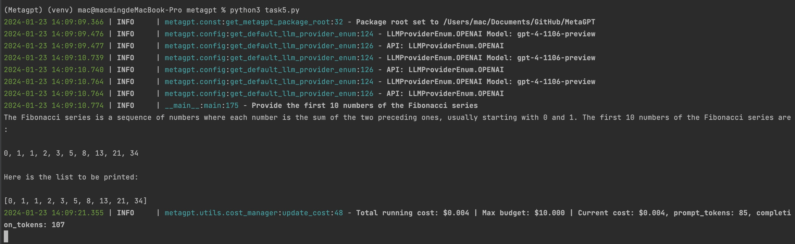
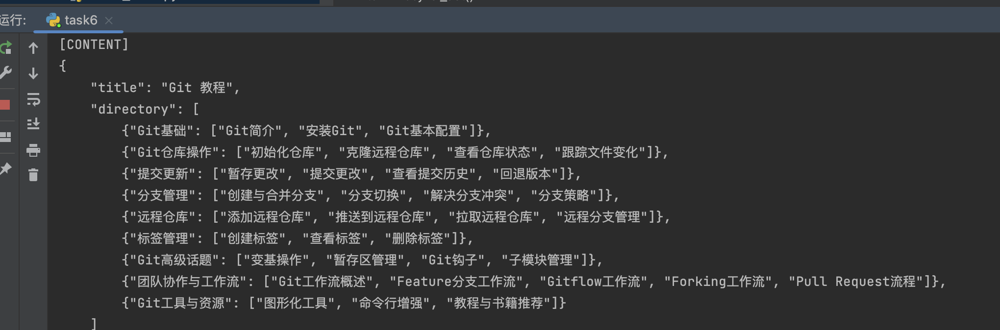

# 第五章：了解ActionNode特性

## 笔记：

ActionNode可以被视为一组动作树，根据类内定义，一个动作树的父节点可以访问所有的子动作节点；也就是说，定义了一个完整的动作树之后，可以从父节点按树的结构顺序执行每一个子动作节点。
我理解是对动作继续进行抽象，把一个Actiono拆分为子Node和顺序。这样就从原子级控制子动作。
好处有两个，一方面精准控制每个子Node的输出质量，一方面可以将一些共有的子Node进行Share.

### 定义单个子节点ActionNode
UI_DESIGN_DESC = ActionNode(
    key="UI Design Desc",
    expected_type=str,
    instruction="place the design objective here",
    example="Snake games are classic and addictive games with simple yet engaging elements. Here are the main elements"
    " commonly found in snake games",
)

### 定义完所有ActionNode之后，将其存放在一个List里面
NODES = [
    UI_DESIGN_DESC,
    SELECTED_ELEMENTS,
    HTML_LAYOUT,
    CSS_STYLES,
    ANYTHING_UNCLEAR,
]

### 将上述List的所有子节点传入父节点UI_DESIGN_NODE中
UI_DESIGN_NODE = ActionNode.from_children("UI_DESIGN", NODES)

ui_describe = await UI_DESIGN_NODE.fill(prompt)

### 这里还有一个关于父节点执行的代码

class THINK_NODES(ActionNode):
    def __init__(self, name="Think Nodes", expected_type=str, instruction="", example=""):
        super().__init__(key=name, expected_type=str, instruction=instruction, example=example)
        self.add_children([SIMPLE_THINK_NODE, SIMPLE_CHECK_NODE])    # 初始化过程，将上面实现的两个子节点加入作为THINK_NODES类的子节点

    async def fill(self, context, llm, schema="raw", mode="auto", strgy="complex"):
        self.set_llm(llm)
        self.set_context(context)
        if self.schema:
            schema = self.schema

        if strgy == "simple":
            return await self.simple_fill(schema=schema, mode=mode)
        elif strgy == "complex":
            # 这里隐式假设了拥有children
            child_context = context    # 输入context作为第一个子节点的context
            for _, i in self.children.items():
                i.set_context(child_context)    # 为子节点设置context
                child = await i.simple_fill(schema=schema, mode=mode)
                child_context = child.content    # 将返回内容（child.content）作为下一个子节点的context

            self.content = child_context    # 最后一个子节点返回的内容设置为父节点返回内容（self.content）
            return self
          

## 复现课堂Demo

## 作业：
1. 用ActionNode完成短篇小说写作（爽文/科幻/言情）

import asyncio
import re
from datetime import datetime
from metagpt.actions.action import Action, ActionNode
from metagpt.logs import logger
from metagpt.roles import Role
from metagpt.schema import Message
from typing import Dict
from metagpt.utils.common import OutputParser
from metagpt.const import TUTORIAL_PATH
from metagpt.utils.file import File

### 命令文本
DIRECTORY_STRUCTION = """
    You are now a seasoned technical professional in the field of the internet. 
    We need you to write a technical tutorial".
    您现在是互联网领域的经验丰富的技术专业人员。
    我们需要您撰写一个技术教程。
    """

### 实例化一个ActionNode，输入对应的参数
DIRECTORY_WRITE = ActionNode(
    # ActionNode的名称
    key="Directory Write",
    # 期望输出的格式
    expected_type=str,
    # 命令文本
    instruction=DIRECTORY_STRUCTION,
    # 例子输入，在这里我们可以留空
    example="",
 )

class WriteDirectory(Action):
    """Action class for writing tutorial directories.

    Args:
        name: The name of the action.
        language: The language to output, default is "Chinese".

        用于编写教程目录的动作类。
        参数：
        name：动作的名称。
        language：输出的语言，默认为"Chinese"。
    """

    language: str = "Chinese"

    def __init__(self, name: str = "", language: str = "Chinese", *args, **kwargs):
        super().__init__()
        self.language = language

    async def run(self, topic: str, *args, **kwargs) -> Dict:
        """Execute the action to generate a tutorial directory according to the topic.

        Args:
            topic: The tutorial topic.

        Returns:
            the tutorial directory information, including {"title": "xxx", "directory": [{"dir 1": ["sub dir 1", "sub dir 2"]}]}.
        根据主题执行生成教程目录的操作。
            参数：
            topic：教程主题。
            返回：
            教程目录信息，包括{"title": "xxx", "directory": [{"dir 1": ["sub dir 1", "sub dir 2"]}]}.
        """

        DIRECTORY_PROMPT = """
        The topic of tutorial is {topic}. Please provide the specific table of contents for this tutorial, strictly following the following requirements:
        1. The output must be strictly in the specified language, {language}.
        2. Answer strictly in the dictionary format like {{"title": "xxx", "directory": [{{"dir 1": ["sub dir 1", "sub dir 2"]}}, {{"dir 2": ["sub dir 3", "sub dir 4"]}}]}}.
        3. The directory should be as specific and sufficient as possible, with a primary and secondary directory.The secondary directory is in the array.
        4. Do not have extra spaces or line breaks.
        5. Each directory title has practical significance.
        教程的主题是{topic}。请按照以下要求提供本教程的具体目录：
        1. 输出必须严格符合指定语言，{language}。
        2. 回答必须严格按照字典格式，如{{"title": "xxx", "directory": [{{"dir 1": ["sub dir 1", "sub dir 2"]}}, {{"dir 2": ["sub dir 3", "sub dir 4"]}}]}}。
        3. 目录应尽可能具体和充分，包括一级和二级目录。二级目录在数组中。
        4. 不要有额外的空格或换行符。
        5. 每个目录标题都具有实际意义。
        """

        # 我们设置好prompt，作为ActionNode的输入
        prompt = DIRECTORY_PROMPT.format(topic=topic, language=self.language)
        # resp = await self._aask(prompt=prompt)
        # 直接调用ActionNode.fill方法，注意输入llm
        # 该方法会返回self，也就是一个ActionNode对象
        resp_node = await DIRECTORY_WRITE.fill(context=prompt, llm=self.llm)
        # 选取ActionNode.content，获得我们期望的返回信息
        resp = resp_node.content
        return OutputParser.extract_struct(resp, dict)

class Printer(Role):

    def __init__(self, name="Jerry", profile="Printer", goal="Print the number", constraints=""):
        super().__init__()

        self._init_actions([WriteDirectory])
        # self.num_list = list()

    async def _think(self) -> None:
        """Determine the action"""
        # logger.info(self._rc.state)

        if self.rc.todo is None:
            self._set_state(0)
            return

        if self.rc.state + 1 < len(self.states):
            self._set_state(self.rc.state + 1)
        else:
            self.rc.todo = None
    async def _act(self) -> Message:
        logger.info(f"{self._setting}: ready to {self.rc.todo}")
        # By choosing the Action by order under the hood
        # todo will be first SimpleWriteCode() then SimpleRunCode()
        todo = self.rc.todo

        msg = self.get_memories(k=1)[0]  # find the most k recent messages
        result = await todo.run(msg.content)

        msg = Message(content=str(result), role=self.profile, cause_by=type(todo))
        self.rc.memory.add(msg)
        return msg
    
    async def _react(self) -> Message:
        """Execute the assistant's think and actions.

        Returns:
            A message containing the final result of the assistant's actions.
        """
        while True:
            await self._think()
            if self.rc.todo is None:
                break
            msg = await self._act()
        root_path = TUTORIAL_PATH / datetime.now().strftime("%Y-%m-%d_%H-%M-%S")
        await File.write(root_path, f"{self.main_title}.md", self.total_content.encode('utf-8'))
        return msg

async def main():
    msg = "git"
    role = Printer()
    logger.info(msg)
    result = await role.run(msg)
    logger.info(result)

if __name__ == '__main__':
    asyncio.run(main())

