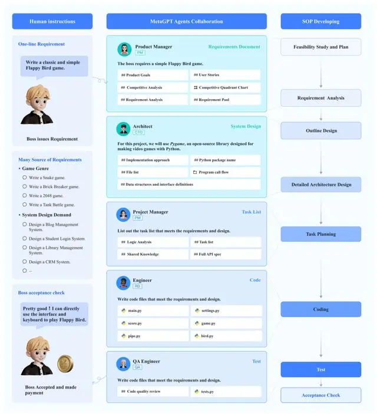
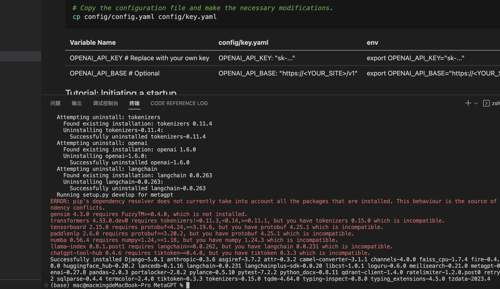
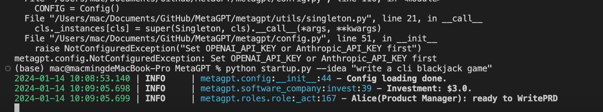
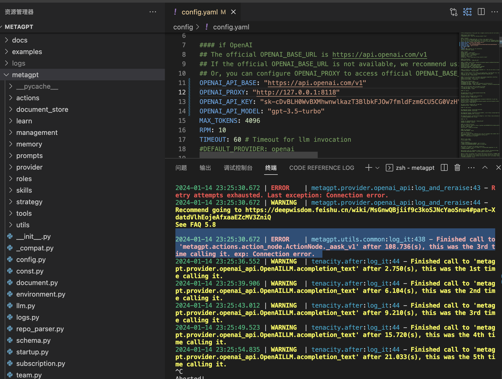
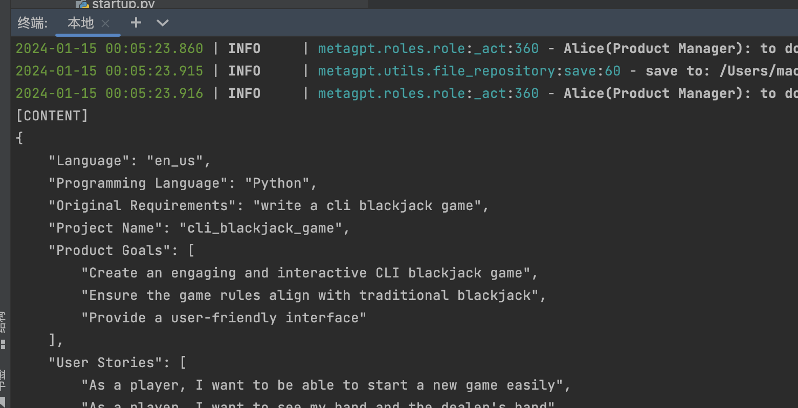
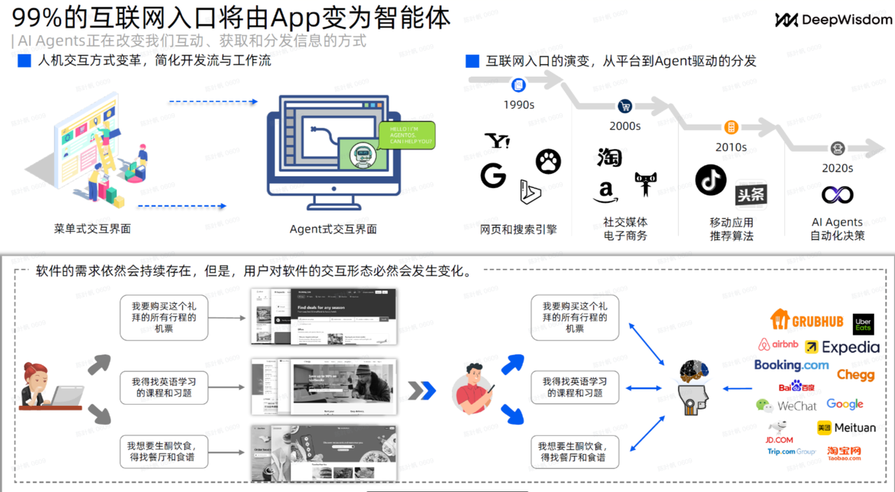

# 第一章和第二章的学习笔记

## 第一章：前期准备

前期准备的内容主要是了解MetaGPT的一些背景知识：

1、为什么有这个项目：
MetaGPT是一个多智能体开源框架，主要用于解决大模型落地应用问题，它可以通过模拟软件公司多角色，输出产品设计、架构图、代码repo等内容。它将会完成编程的自动化，完整利用AgentOS能力，完成Agent的大规模生产.

2、这个项目解决了什么问题，有什么大的突破：
MetaGPT提供了Agent的开发能力，Agent可以协助我们解决日常的一些问题，其中一个应用场景就是我们可以让Agent为我们关注某些想关注的信息，当有我们关注的事件发生时，Agent获取信息并进行处理，然后通过一些如邮件、微信、discord等通知渠道将处理后的信息发送给我们。我们将这类Agent称为订阅智能体，这类智能体可以结合MetaGPT的PubSub模块运行。本文档通过一个OSS（Open Source Software）订阅智能体实现示例教大家如何使用MetaGPT实现一个订阅智能体

3、这个项目的特色功能是什么：

订阅智能体的实现主要有3个要素，分别是Role、Trigger、Callback，即智能体本身、触发器、数据回调。我们首先按要实现一个OSSWatcher的角色，OSS即Open source software，我们对OSS智能体定位是，帮我们关注并分析热门的开源项目，当有相关信息时将信息推送给我们；然后Trigger是指这个OSSWatcher的角色什么时候触发，我们可以是定时触发或者是某个网站有更新时触发；最后，Callback可以设置OSSWatcher角色运行生成的信息，我们可以将数据发送到微信或者discord

4、这个课程的应用方向是什么：
你是否曾梦想拥有一个专属的AI助手，为你解决日常琐事，提供实时资讯？课程将深入浅出地教授如何使用MetaGPT开发爬取trending内容的智能体，并将其部署到微信、Discord等平台。通过这门课程，你将学会：
- MetaGPT框架的基本使用方法，
- 设计和实现智能体的完整流程；
- 如何将智能体部署到微信、Discord等平台；
- 掌握智能体开发的相关技能，为进一步个性化开发奠定基础。

5、学习规划
- task1：第一章：前期准备
- task2：第二章：AI Agent知识体系结构
- task3：第三章：MetaGPT框架组件教程
- task4：第四章：OSS - 订阅智能体
- task5：第五章：action node
- task6：第六章：进阶订阅智能体开发

6、本地环境准备

1. git仓库代码并安装
2. 配置环境参数
3. 初步运行项目

没有运行成功

改用Pycharm,运行成功

## 第二章：AI Agent知识体系结构

这个章节会对Agent进行深入了解，并利用MetaGPT体会下Agent的功能

1、智能体的定义

智能体 = LLM+观察+思考+行动+记忆

我的理解是可以理解语义，自主观察，计划，执行的AI

以任务执行为例，智能体应该是可以独立完成某些工作，类似与RPA. 但又超越了RPA.

RPA是人来规划动作，机器执行。智能体是由Agent来规划动作，自己执行。

2、热门的智能体案例

这张图非常值得思考，Agent的发展方向是什么？

3、AI Agent和 Sy1 & Sy2

系统一和系统二的思维概念，很好的解释了人类的短思考和长思考。

短思考是不需要消耗能量，直觉或者习惯性的处理事件。

长思考是没有经历过的事情或者重大的必须要思考的事情，那么会有复杂的思考过程和逻辑判断。

Metagpt是一个成熟的AI Agent，会执行类似系统二的思考。

