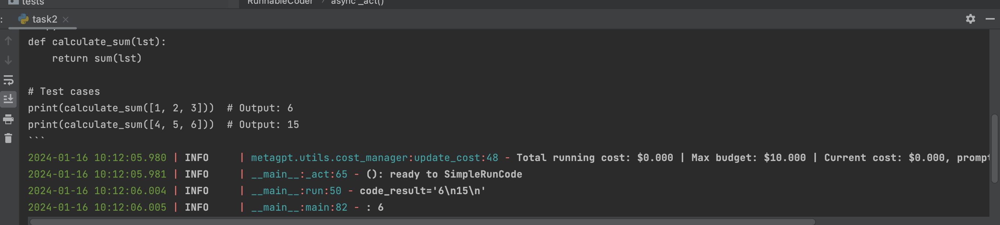
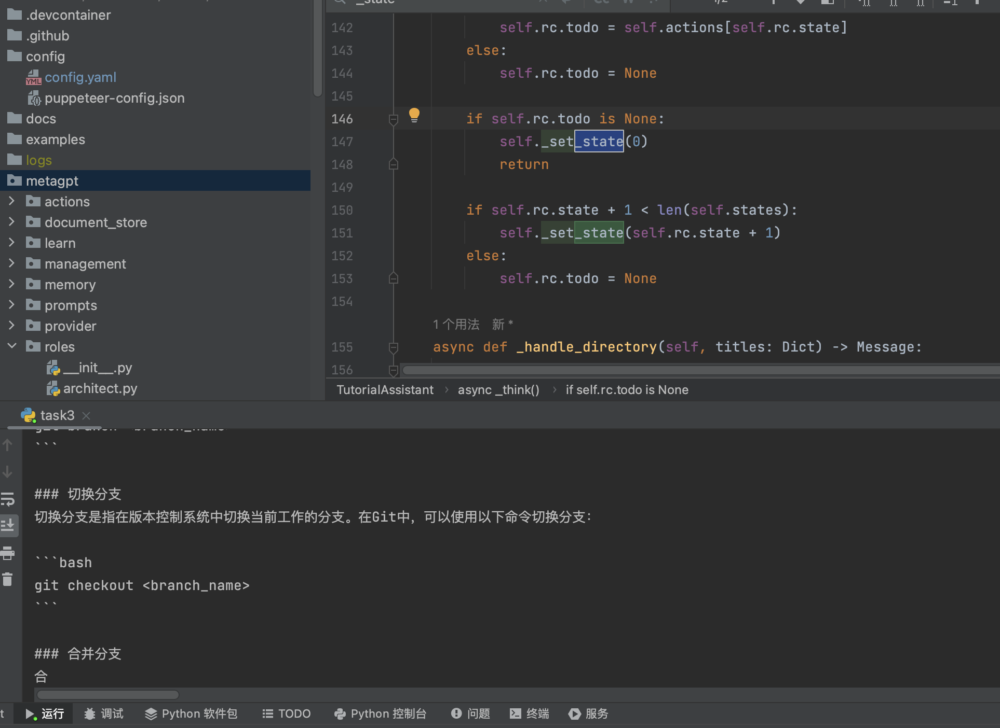

# 第三章 MetaGPT框架组件介绍

1、Agent概念概述
在MetaGPT看来，
Agent = 大语言模型（LLM） + 观察 + 思考 + 行动 + 记忆
这个公式概括了智能体的功能本质。为了理解每个组成部分，让我们将其与人类进行类比：
1. 大语言模型（LLM）：基座
2. 观察：智能体可能会接收来自另一个智能体的文本消息、来自监视摄像头的视觉数据或来自客户服务录音的音频等一系列信号。这些观察构成了所有后续行动的基础。
3. 思考：思考过程涉及分析观察结果和记忆内容并考虑可能的行动。这是智能体内部的决策过程，其可能由LLM进行驱动。这是RAC吗
4. 行动：这个应该是Tool函数
5. 记忆：智能体的记忆存储过去的经验。这对学习至关重要，因为它允许智能体参考先前的结果并据此调整未来的行动。

2、课堂练习

- SimpleWriteCode的代码部分

import re
import asyncio
from metagpt.actions import Action
from metagpt.roles import Role
from metagpt.schema import Message
from metagpt.logs import logger
from typing import ClassVar

class SimpleWriteCode(Action):

    PROMPT_TEMPLATE: ClassVar[str]  = """
    Write a python function that can {instruction} and provide two runnable test cases.
    Return ```python your_code_here ``` with NO other texts,
    your code:
    """

    def __init__(self, name="SimpleWriteCode", context=None, llm=None):
        super().__init__()

    async def run(self, instruction: str):

        prompt = self.PROMPT_TEMPLATE.format(instruction=instruction)

        rsp = await self._aask(prompt)

        code_text = SimpleWriteCode.parse_code(rsp)

        return code_text

    @staticmethod
    def parse_code(rsp):
        pattern = r'```python(.*)```'
        match = re.search(pattern, rsp, re.DOTALL)
        code_text = match.group(1) if match else rsp
        return code_text

class SimpleCoder(Role):
    def __init__(
        self,
        name: str = "Alice",
        profile: str = "SimpleCoder",
        **kwargs,
    ):
        super().__init__( **kwargs)
        self._init_actions([SimpleWriteCode])

    async def _act(self) -> Message:
        logger.info(f"{self._setting}: ready to {self.rc.todo}")
        todo = self.rc.todo  # todo will be SimpleWriteCode()

        msg = self.get_memories(k=1)[0]  # find the most recent messages

        code_text = await todo.run(msg.content)
        msg = Message(content=code_text, role=self.profile,
                      cause_by=type(todo))

        return msg

async def main():
    msg = "write a function that calculates the sum of a list"
    role = SimpleCoder()
    logger.info(msg)
    result = await role.run(msg)
    logger.info(result)

asyncio.run(main())

- SimpleRunCode的代码部分

import os
import re
import subprocess
import asyncio

import fire
import sys
from metagpt.llm import LLM
from metagpt.actions import Action
from metagpt.roles import Role
from metagpt.schema import Message
from metagpt.logs import logger
from typing import ClassVar

class SimpleWriteCode(Action):

    PROMPT_TEMPLATE: ClassVar[str]  = """
    Write a python function that can {instruction} and provide two runnnable test cases.
    Return ```python your_code_here ``` with NO other texts,
    your code:
    """

    def __init__(self, name: str = "SimpleWriteCode", context=None, llm: LLM = None):
        super().__init__()

    async def run(self, instruction: str):

        prompt = self.PROMPT_TEMPLATE.format(instruction=instruction)

        rsp = await self._aask(prompt)

        code_text = SimpleWriteCode.parse_code(rsp)

        return code_text

    @staticmethod
    def parse_code(rsp):
        pattern = r'```python(.*)```'
        match = re.search(pattern, rsp, re.DOTALL)
        code_text = match.group(1) if match else rsp
        return code_text

class SimpleRunCode(Action):
    def __init__(self, name: str = "SimpleRunCode", context=None, llm: LLM = None):
        super().__init__()

    async def run(self, code_text: str):
        result = subprocess.run([sys.executable, "-c", code_text], capture_output=True, text=True)
        code_result = result.stdout
        logger.info(f"{code_result=}")
        return code_result

class RunnableCoder(Role):
    def __init__(
        self,
        name: str = "Alice",
        profile: str = "RunnableCoder",
        **kwargs,
    ):
        super().__init__(**kwargs)
        self._init_actions([SimpleWriteCode, SimpleRunCode])
        self._set_react_mode(react_mode="by_order")

    async def _act(self) -> Message:
        logger.info(f"{self._setting}: ready to {self.rc.todo}")
        # By choosing the Action by order under the hood
        # todo will be first SimpleWriteCode() then SimpleRunCode()
        todo = self.rc.todo

        msg = self.get_memories(k=1)[0] # find the most k recent messagesA
        result = await todo.run(msg.content)

        msg = Message(content=result, role=self.profile, cause_by=type(todo))
        self.rc.memory.add(msg)
        return msg

async def main():
    msg = "write a function that calculates the sum of a list"
    role = RunnableCoder()
    logger.info(msg)
    result = await role.run(msg)
    logger.info(result)

asyncio.run(main())




- WriteDirectory 

from datetime import datetime
from typing import Dict
import asyncio
from metagpt.actions.write_tutorial import WriteDirectory, WriteContent
from metagpt.const import TUTORIAL_PATH
from metagpt.logs import logger
from metagpt.roles import Role
from metagpt.schema import Message
from metagpt.utils.file import File
import fire

from typing import Dict

from metagpt.actions import Action
from metagpt.prompts.tutorial_assistant import DIRECTORY_PROMPT, CONTENT_PROMPT
from metagpt.utils.common import OutputParser

class WriteDirectory(Action):
    """Action class for writing tutorial directories.

    Args:
        name: The name of the action.
        language: The language to output, default is "Chinese".
    """

    def __init__(self, name: str = "", language: str = "Chinese", *args, **kwargs):
        super().__init__(**kwargs)
        #self.language = language

    async def run(self, topic: str, *args, **kwargs) -> Dict:
        """Execute the action to generate a tutorial directory according to the topic.

        Args:
            topic: The tutorial topic.

        Returns:
            the tutorial directory information, including {"title": "xxx", "directory": [{"dir 1": ["sub dir 1", "sub dir 2"]}]}.
        """
        COMMON_PROMPT = """
        You are now a seasoned technical professional in the field of the internet. 
        We need you to write a technical tutorial with the topic "{topic}".
        """

        DIRECTORY_PROMPT = COMMON_PROMPT + """
        Please provide the specific table of contents for this tutorial, strictly following the following requirements:
        1. The output must be strictly in the specified language, {language}.
        2. Answer strictly in the dictionary format like {{"title": "xxx", "directory": [{{"dir 1": ["sub dir 1", "sub dir 2"]}}, {{"dir 2": ["sub dir 3", "sub dir 4"]}}]}}.
        3. The directory should be as specific and sufficient as possible, with a primary and secondary directory.The secondary directory is in the array.
        4. Do not have extra spaces or line breaks.
        5. Each directory title has practical significance.
        """
        prompt = DIRECTORY_PROMPT.format(topic=topic, language="")
        resp = await self._aask(prompt=prompt)
        return OutputParser.extract_struct(resp, dict)

class WriteContent(Action):
    """Action class for writing tutorial content.

    Args:
        name: The name of the action.
        directory: The content to write.
        language: The language to output, default is "Chinese".
    """

    directory: str = ""
    language: str = "Chinese"

    def __init__(self, name: str = "", directory: str = "", language: str = "Chinese", *args, **kwargs):
        super().__init__(**kwargs)
        self.language = language
        self.directory = directory

    async def run(self, topic: str, *args, **kwargs) -> str:
        """Execute the action to write document content according to the directory and topic.

        Args:
            topic: The tutorial topic.

        Returns:
            The written tutorial content.
        """
        COMMON_PROMPT = """
        You are now a seasoned technical professional in the field of the internet. 
        We need you to write a technical tutorial with the topic "{topic}".
        """
        CONTENT_PROMPT = COMMON_PROMPT + """
        Now I will give you the module directory titles for the topic. 
        Please output the detailed principle content of this title in detail. 
        If there are code examples, please provide them according to standard code specifications. 
        Without a code example, it is not necessary.

        The module directory titles for the topic is as follows:
        {directory}

        Strictly limit output according to the following requirements:
        1. Follow the Markdown syntax format for layout.
        2. If there are code examples, they must follow standard syntax specifications, have document annotations, and be displayed in code blocks.
        3. The output must be strictly in the specified language, {language}.
        4. Do not have redundant output, including concluding remarks.
        5. Strict requirement not to output the topic "{topic}".
        """
        prompt = CONTENT_PROMPT.format(
            topic=topic, language=self.language, directory=self.directory)
        return await self._aask(prompt=prompt)

class TutorialAssistant(Role):
    """Tutorial assistant, input one sentence to generate a tutorial document in markup format.

    Args:
        name: The name of the role.
        profile: The role profile description.
        goal: The goal of the role.
        constraints: Constraints or requirements for the role.
        language: The language in which the tutorial documents will be generated.
    """
    language: str = "Chinese"
    topic: str = ""
    main_title: str = ""
    total_content: str = ""
    def __init__(
        self,
        name: str = "Stitch",
        profile: str = "Tutorial Assistant",
        goal: str = "Generate tutorial documents",
        constraints: str = "Strictly follow Markdown's syntax, with neat and standardized layout",
        language: str = "Chinese",
        main_title: str = "",
        ):
        super().__init__()
        self._init_actions([WriteDirectory()])
        #self.topic = ""
        #self.main_title = main_title
        #self.total_content = ""
        #self.language = language

    async def _think(self) -> None:
        """Determine the next action to be taken by the role."""
        logger.info(self.rc.state)
        logger.info(self,)

        if 0 <= self.rc.state < len(self.actions):
            self.rc.todo = self.actions[self.rc.state]
        else:
            self.rc.todo = None

        if self.rc.todo is None:
            self._set_state(0)
            return
        
        if self.rc.state + 1 < len(self.states):
            self._set_state(self.rc.state + 1)
        else:
            self.rc.todo = None

    async def _handle_directory(self, titles: Dict) -> Message:
        """Handle the directories for the tutorial document.

        Args:
            titles: A dictionary containing the titles and directory structure,
                    such as {"title": "xxx", "directory": [{"dir 1": ["sub dir 1", "sub dir 2"]}]}

        Returns:
            A message containing information about the directory.
        """
        self.main_title = titles.get("title")
        directory = f"{self.main_title}\n"
        self.total_content += f"# {self.main_title}"
        actions = list()
        for first_dir in titles.get("directory"):
            actions.append(WriteContent(
                language=self.language, directory=first_dir))
            key = list(first_dir.keys())[0]
            directory += f"- {key}\n"
            for second_dir in first_dir[key]:
                directory += f"  - {second_dir}\n"
        self._init_actions(actions)
        self.rc.todo = None
        return Message(content=directory)

    async def _act(self) -> Message:
        """Perform an action as determined by the role.

        Returns:
            A message containing the result of the action.
        """
        todo = self.rc.todo
        if type(todo) is WriteDirectory:
            msg = self.rc.memory.get(k=1)[0]
            #self.topic = msg.content
            #resp = await todo.run(topic=self.topic)
            resp = await todo.run(topic=msg.content)
            logger.info(resp)
            return await self._handle_directory(resp)
        resp = await todo.run(topic=self.topic)
        logger.info(resp)
        if self.total_content != "":
            self.total_content += "\n\n\n"
        self.total_content += resp
        return Message(content=resp, role=self.profile)

    async def _react(self) -> Message:
        """Execute the assistant's think and actions.

        Returns:
            A message containing the final result of the assistant's actions.
        """
        while True:
            await self._think()
            if self.rc.todo is None:
                break
            msg = await self._act()
        root_path = TUTORIAL_PATH / datetime.now().strftime("%Y-%m-%d_%H-%M-%S")
        await File.write(root_path, f"{self.main_title}.md", self.total_content.encode('utf-8'))
        return msg

async def main():
    msg = "Git 教程"
    role = TutorialAssistant()
    logger.info(msg)
    result = await role.run(msg)
    logger.info(result)

asyncio.run(main())




3、编写这样一个 agent
- 这个 Agent 拥有三个动作 打印1 打印2 打印3（初始化时 init_action([print,print,print])）
- 重写有关方法（请不要使用act_by_order，我希望你能独立实现）使得 Agent 顺序执行上面三个动作
- 当上述三个动作执行完毕后，为 Agent 生成新的动作 打印4 打印5 打印6 并顺序执行，（之前我们初始化了三个 print 动作，执行完毕后，重新 init_action([...,...,...])，然后顺序执行这个新生成的动作列表)

from metagpt.roles import Role
import asyncio
class MyAgent(Role):
    
    current_action: int = 0
    actions: list[callable] = []

    def __init__(self, name="MyAgent"):
        super().__init__()
        self._init_actions([self.print1, self.print2, self.print3])


    def _init_actions(self, actions):
        self.actions = actions
        self.current_action = 0

    async def _think(self):
        while self.current_action < len(self.actions):
            await self.actions[self.current_action]()
            self.current_action += 1
        self._init_actions([self.print4, self.print5, self.print6])
        while self.current_action < len(self.actions):
            await self.actions[self.current_action]()
            self.current_action += 1

    async def print1(self):
        print("1")

    async def print2(self):
        print("2")

    async def print3(self):
        print("3")

    async def print4(self):
        print("4")

    async def print5(self):
        print("5")

    async def print6(self):
        print("6")

if __name__ == "__main__":
    agent = MyAgent()
    asyncio.run(agent._think())


4、关于这个 Agent 我们还有更多可以思考的地方
- 目前为止我们设计的所有思考模式都可以总结为是链式的思考（chain of thought），能否利用 MetaGPT 框架实现树结构的思考（tree of thought）图结构的思考（graph of thought）？试着实现让 ai 生成树结构的动作列表，并按照树的遍历方式执行他们，如果你实现，这将是加分项