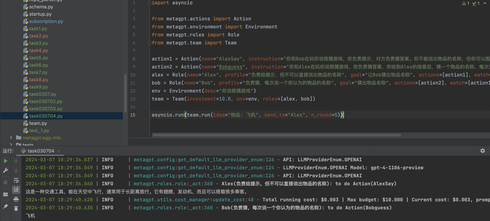
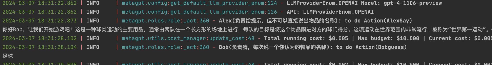

# 多智能体
今天学习多智能体。包括多智能体的定义，交互，合作。 https://deepwisdom.feishu.cn/wiki/MLILw0EdRiyiYRkJLgOcskyAnUh
关键知识点：
- 多智能体的定义：多个Role合作可以称为多智能体。
- 交互：Environment的设置是多个Role交互的公共区域，desc 用于描述当前的环境信息，role 用来指定当前环境中的角色，member则表示当前环境中的角色以及他们对应的状态，history则用于记录环境中发生的消息记录
- 合作：Team就是基于 Environment 之上的二次封装成果
- self._watch，每个智能体观察环境，订阅其他智能体的触发器
- classroom.add_roles([Student(), Teacher()])：环境装载角色的顺序也很重要

随后案例给出了三到五个很实际的案例，向我们展示了多智能体的表现。

我非常喜欢的是这个案例：

import asyncio

from metagpt.actions import Action
from metagpt.environment import Environment
from metagpt.roles import Role
from metagpt.team import Team

action1 = Action(name="AlexSay", instruction="Express your opinion with emotion and don't repeat it")
action2 = Action(name="BobSay", instruction="Express your opinion with emotion and don't repeat it")
alex = Role(name="Alex", profile="Democratic candidate", goal="Win the election", actions=[action1], watch=[action2])
bob = Role(name="Bob", profile="Republican candidate", goal="Win the election", actions=[action2], watch=[action1])
env = Environment(desc="US election live broadcast")
team = Team(investment=10.0, env=env, roles=[alex, bob])

asyncio.run(team.run(idea="Topic: climate change. Under 80 words per message.", send_to="Alex", n_round=5))

它非常简单，且自带SOP逻辑

基础作业：

import asyncio

from metagpt.actions import Action
from metagpt.environment import Environment
from metagpt.roles import Role
from metagpt.team import Team

action1 = Action(name="AlexSay", instruction="你和Bob在玩你说我猜游戏，你负责提示，对方负责猜答案。你不能说出物品的名称，但你可以围绕这个物品的属性和用途给一些提示，只到Bob猜对为止。")
action2 = Action(name="Bobguess", instruction="你和Alex在玩你说我猜游戏，你负责猜答案，你收到Alex的信息后，猜一个物品的名称，每次只能报一个名称")
alex = Role(name="Alex", profile="负责给提示，但不可以直接说出物品的名称", goal="让Bob猜出物品名称", actions=[action1], watch=[action2])
bob = Role(name="Bob", profile="负责猜，每次说一个你认为的物品的名称", goal="猜出物品名称", actions=[action2], watch=[action1])
env = Environment(desc="你说我猜游戏")
team = Team(investment=10.0, env=env, roles=[alex, bob])

asyncio.run(team.run(idea="物品: 飞机", send_to="Alex", n_round=5))

